# Procesverslag

## Concept
    Deze website is gebouwd om gamers te helpen bij het ontdekken van unreleased games op Steam. Omdat deze games nog niet uit zijn, is het vaak lastig om hier goede info over te vinden. Deze tool maakt het makkelijker om ze alvast te bekijken en in de gaten te houden.

Features
	•	Homepage met een overzicht van unreleased games
	•	Hero met een featured game, inclusief trailer
	•	Detailpagina per game met o.a.:
	•	Prijs (indien beschikbaar)
	•	Nieuwsartikelen
	•	Beschrijving
	•	Releasedatum (indien aangekondigd)

Waarom?

Als gamer ben je vaak op zoek naar de volgende vette game — maar unreleased titels vind je niet zomaar. Deze tool helpt je om een beter beeld te krijgen van wat eraan komt op Steam, zodat je niks mist. Én je kunt er meteen onderzoek naar doen. Ik geef onder aan de games op op de datailpagina artikelen weer die mensen kunnen lezen. Zo kun je je als gebruiker verdiepen in games en kun je alvast onderzoeken of er wat voor je tussen zit.

## Proces

### Gebruikte Api's
content
- SteamNewsAPI
- Steam GameDetails API
- SteamSPY Api (uiteindelijk vervangen door de GameDetails API)

web
- Internationalization API voor currency en prijs display
- ViewTransition om visueel aantrekkelijk te maken van de Genres

anders
- JSON Parser

### Week 1 - schets & concept week
    Enorme struggle het vinden van de juiste content api voor mijn concept.
    Uiteindelijk een NewsApi, game details api en een steamspy api gevonden.
    Allemaal weer voor wat anders nuttig.

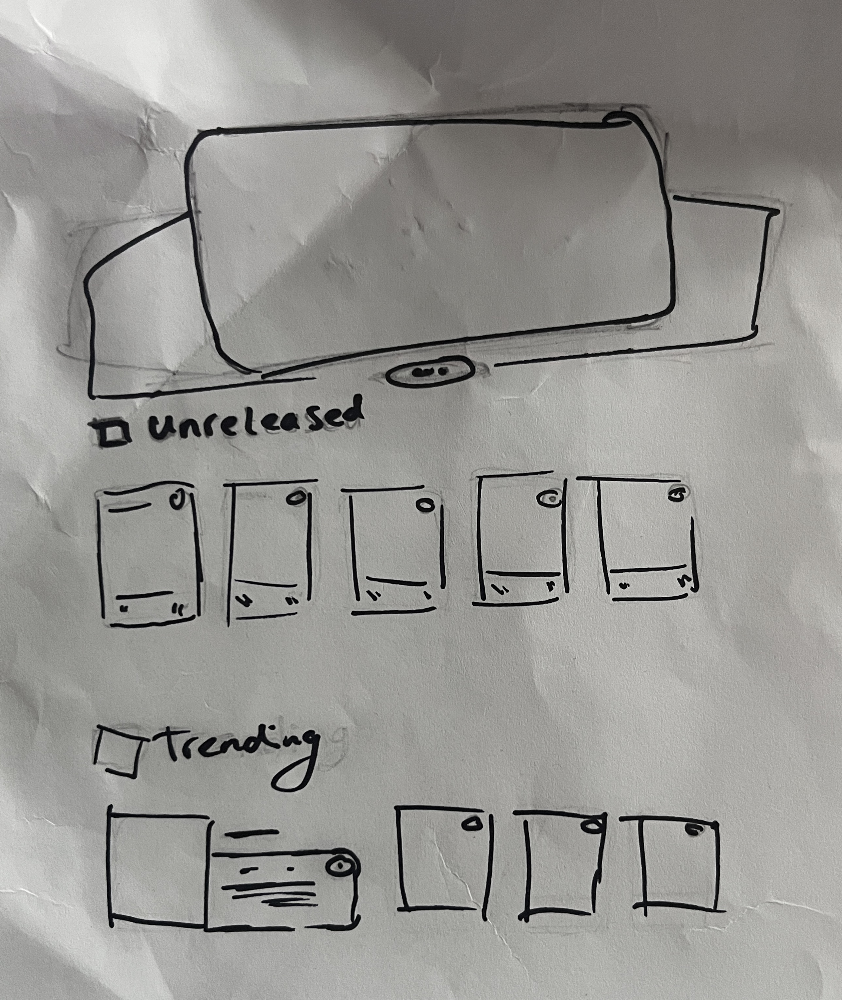
*Een eerste hele grove schets van de homepage met een overzicht van unreleased games en het idee voor een featured game hero.*

    Ik heb mijn grove schets iets inzichtelijker gemaakt door de lofi schets.Daarbij gekeken in mijn api welke data ik kan ophalen om mijn wens te vervullen.

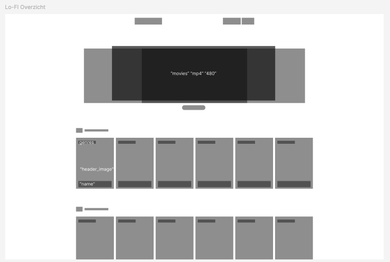

     Voor de detailpagina ook in kaart gebracht wat ik wilde tonen.

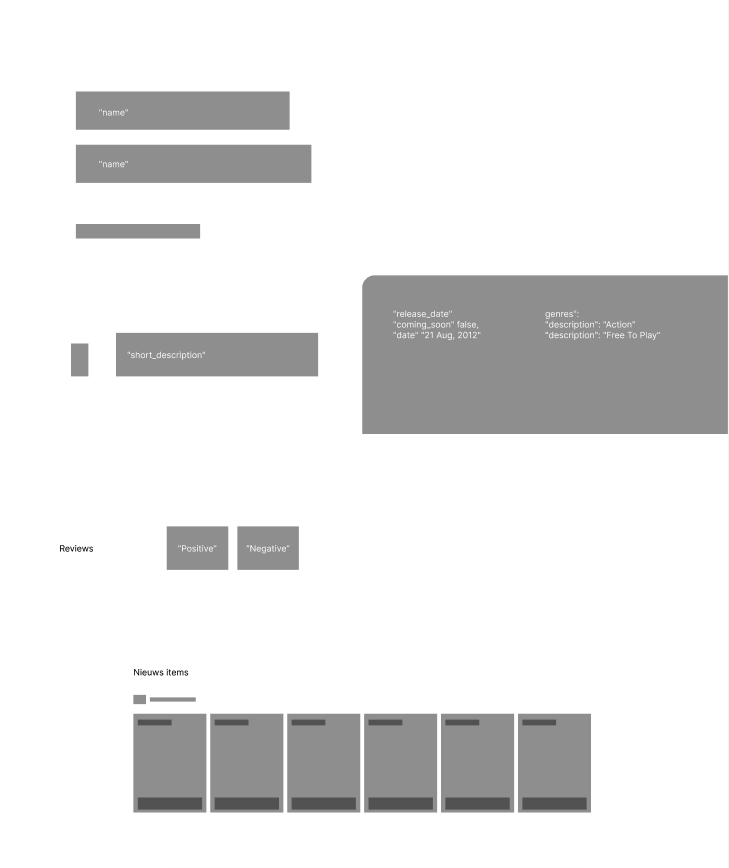

    IK heb eigenlijk intentioneel niet veel aandacht besteeds aan de schets.
    Maak altijd hifi designs in fimga, maar vaak is dat ook mijn valkuil.
    Ik ga dan op de styling letten en niet op het geen waar we hier voor zitten.
    Dus wilde het design gaanderweg integreren met een inspiratie design van dribble voor de vibe.

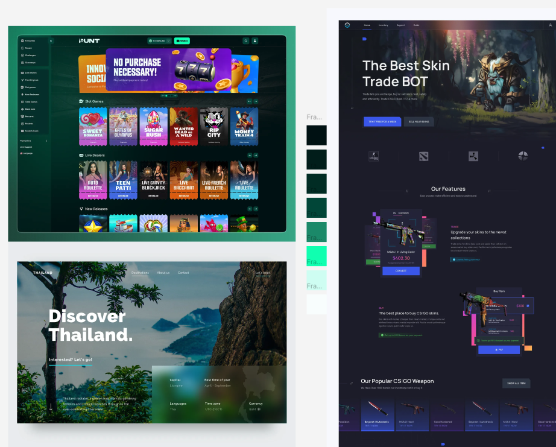

### Week 2 - Basis opzetten
    
    Het ophalen van de data ging hier en daar wat moeizaam. Niet heel gek zonder kennis van hoe en wat.
    Maar in de basis kon ik wel wat dingen ophalen. Ik kon een game tonen en een datum hierbij laten zien.

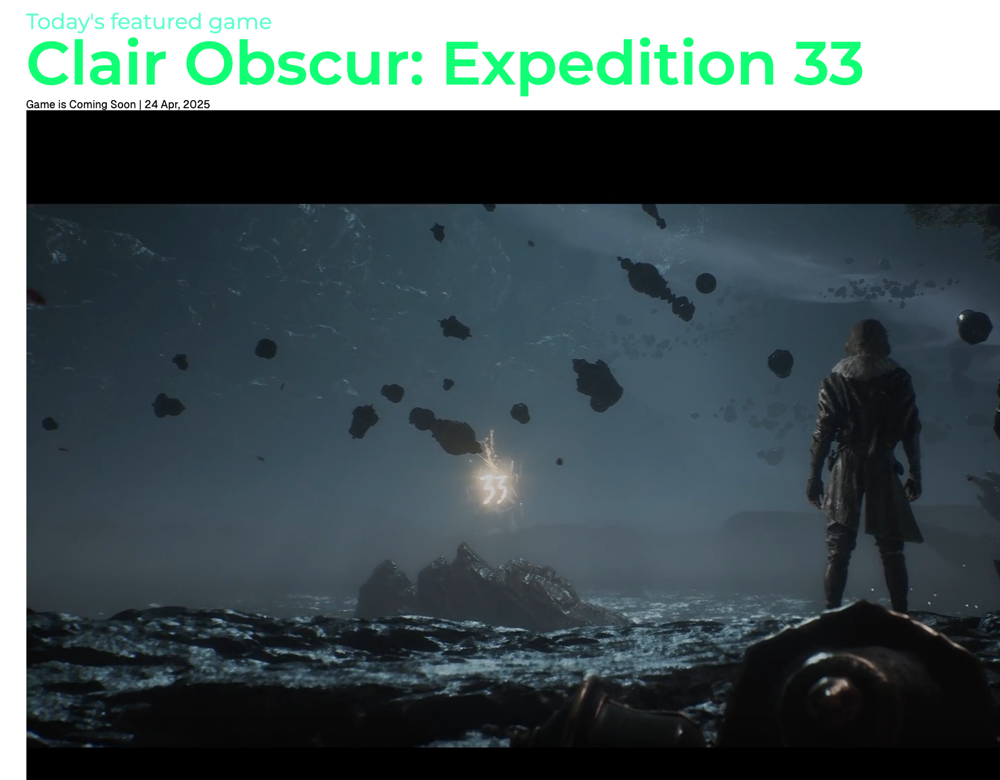
*versie 1 overview pagina.*

### Week 3 - Concept verwerken in pagina
    Het was me in week 3 gelukt om een featured game te tonen. Steeds random een andere game in deze discovery sectie.
    Op de achtergrond speelt meteen een toffe enthousiasmerende trailer om de gebruiker een eerste indruk te geven.
    Buiten de naam en datum wil ik niets meer prijsgeven, het moet eerst visueel je aandacht trekken, als je dan doorklikt op view game is het de bedoeling dat je meer info krijgt over het genre en een beschrijving van de game.

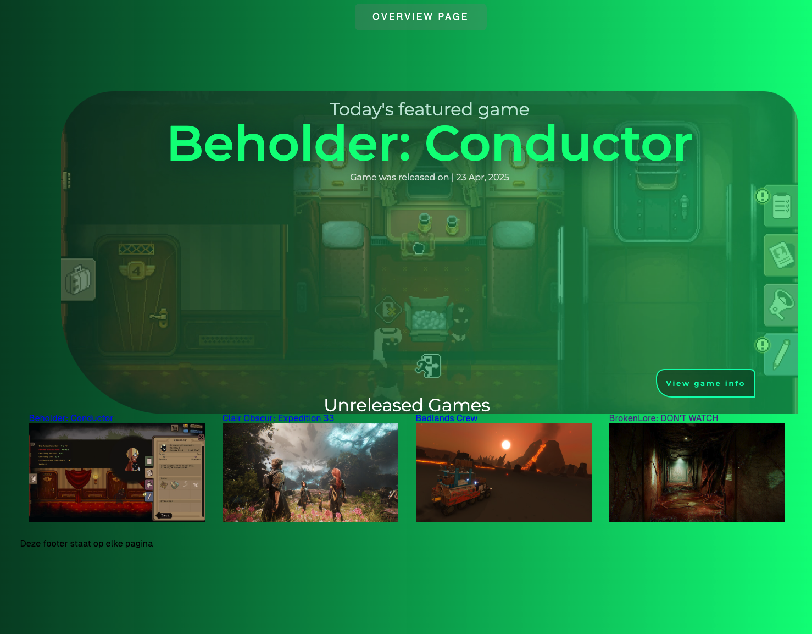
*versie 2 overview pagina.*

### Week 4 - Concept verwerken in pagina
    Dit was de week waar ik nog een hoop moest doen qua styling.
    Heb logica toegevoegd op de datum van de release. Je ziet nu of hij al uit is OF dat hij nog komt OF dat er al een datum bekend is.

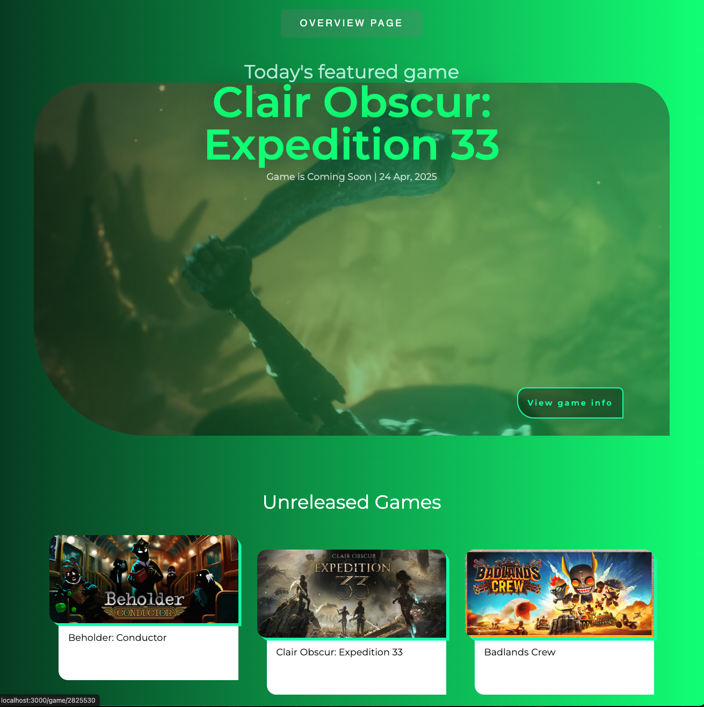
*versie 3 overview pagina - mist nog wat styling en responsiveness fix was hard nodig.*

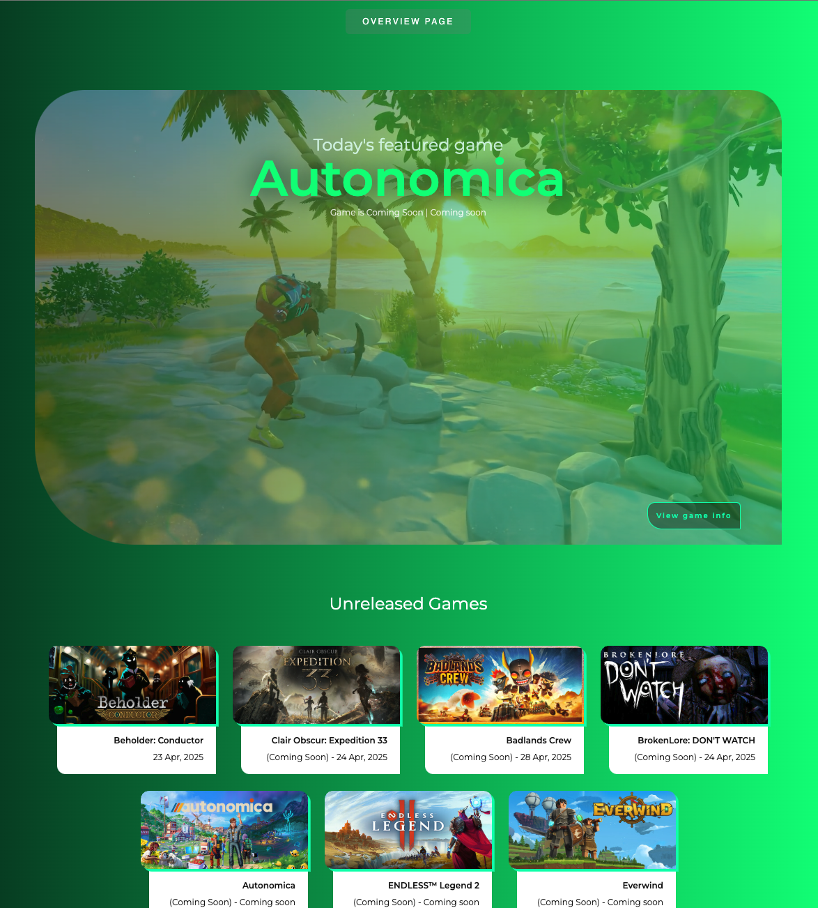
*versie 4 overview pagina - responsive op alle devices mobile first en card design van unreleased games.*

*v4 hero view op mobile*

*v4 card view op mobile*

Deze week heb ik met declan gezeten om games op te halen uit mijn statisch gekozen app'id maar mijn functie was daar niet robuust genoeg voor.
Hij heeft me geholpen en geleerd dat je het anders kan doen. Ik heb daarna geprobeerd in de comments het voor mezelf juist uit te leggen en denk dat ik het aardig begrepen heb. Heb later in mijn code ook weer .map gebruikt.
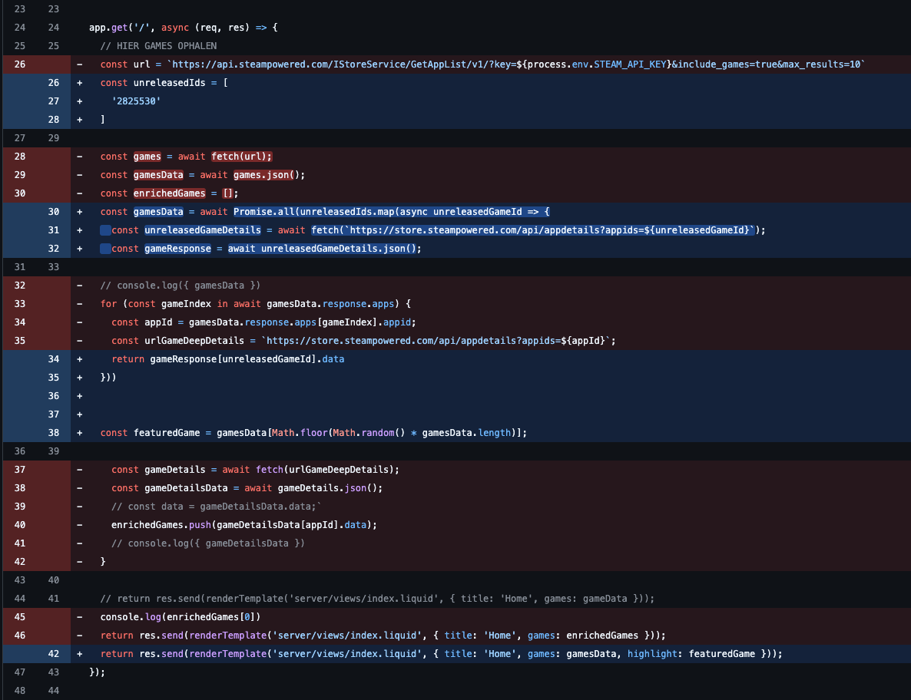
*oude versie*

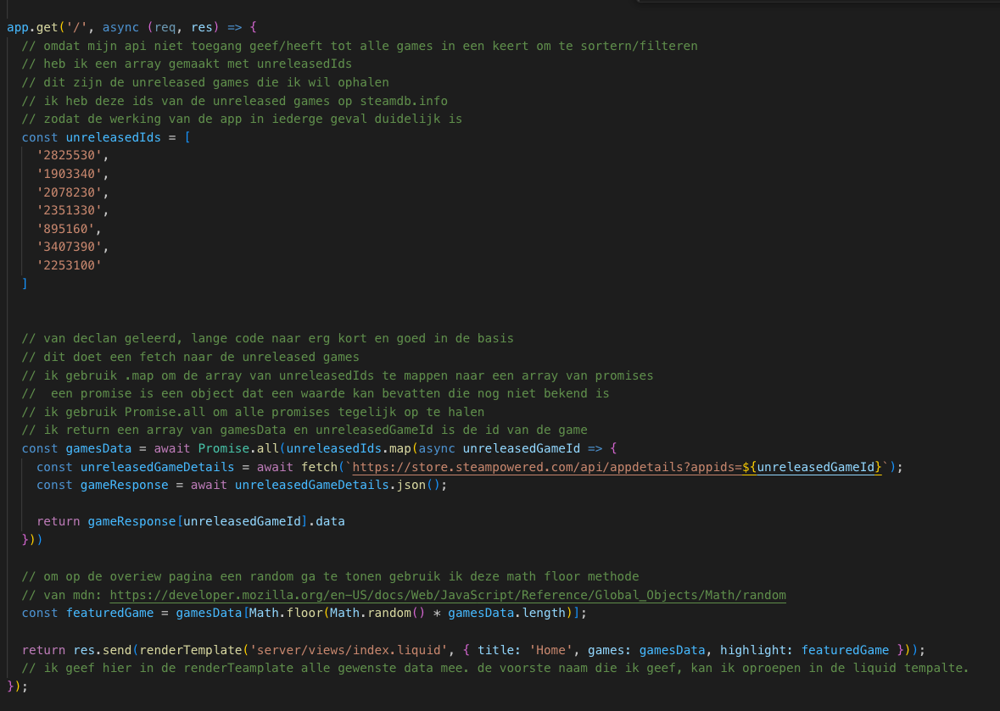
*nieuwe versie*

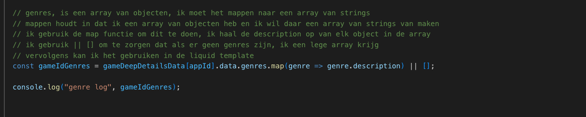
*hier heb ik dan ook weer map gebruikt om de array te fixen voor mijn viewtransition*

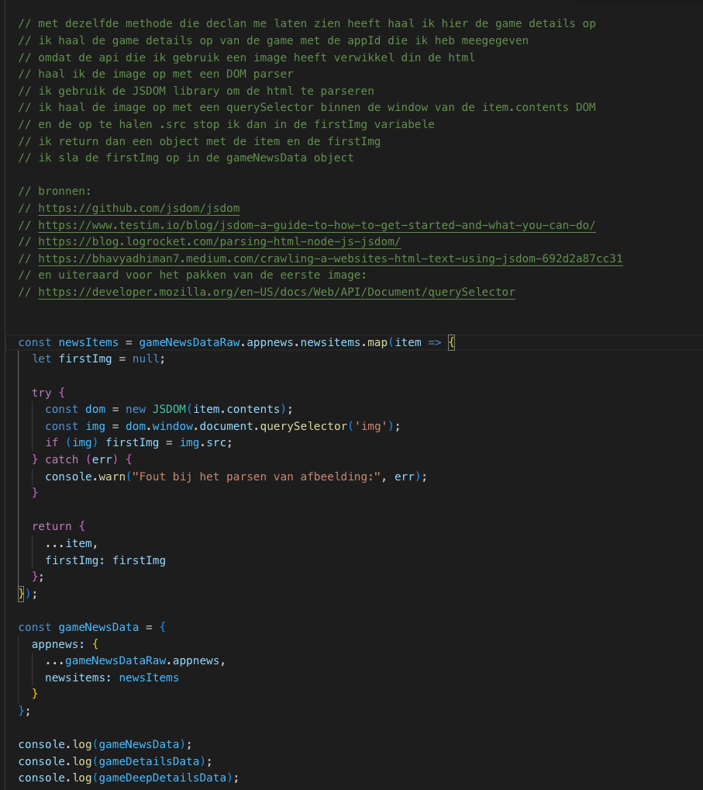
*json parser

    Deze code vind ik heel tof. Mijn api deed even vervelend met het meegeven van img's bij appId's omdat het verwikkeld zit in json of soms html. En ik heb dan toegevoegd als hij geen image kan vinden of laden dat hij de image laadt die bij de gameDetails api in de screenshots voorkomt.

    In deze week heb ik ook de artikelen eindelijk gefixt dat de artikelen images goed geladen worden.
    Daar heb ik het volgende voor bedacht:
    Met de json parser haal ik uiteraard images uit de newsitems in de APi, maar veel images laden niet (door een anti-bot verification test die die niet behaald) dus heb ik gemaakt dat als hij geen image kan halen uit de API dat hij het volgende doet:

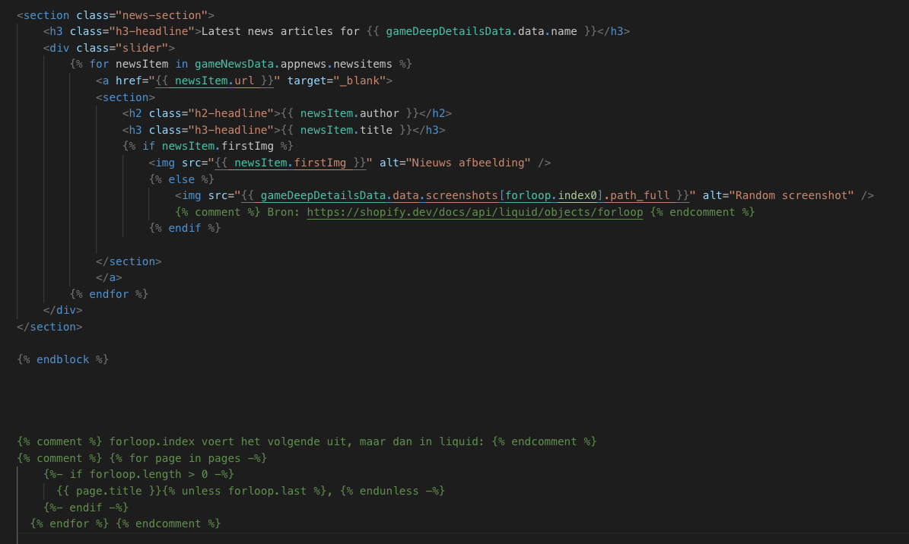

    Hij loopt 1 voor  1 door de images en gebruikt deze totdat het eind van het aantal is bereikt, dan begin hij weer vooraan. Onder in de comment staat wat de forloop.index0 precies doet maar ik maak gebruik van de kracht van liquid object.
    bron: https://shopify.dev/docs/api/liquid/objects/forloop

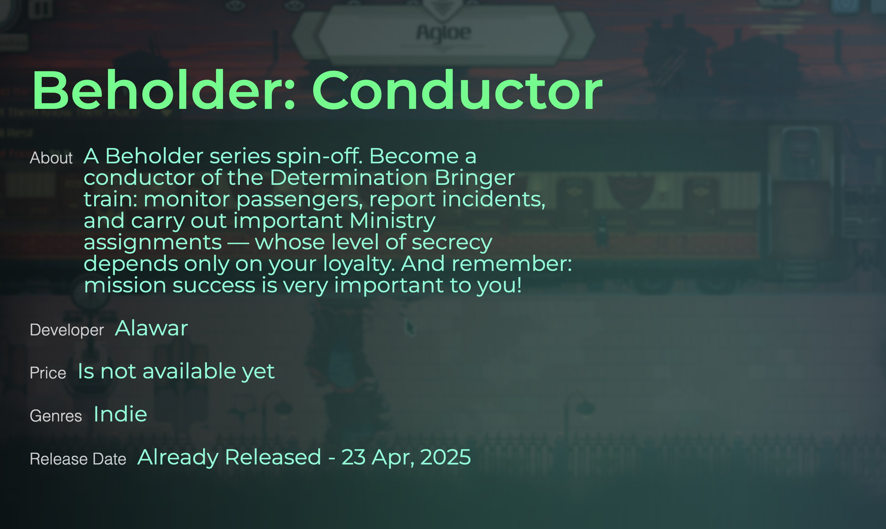
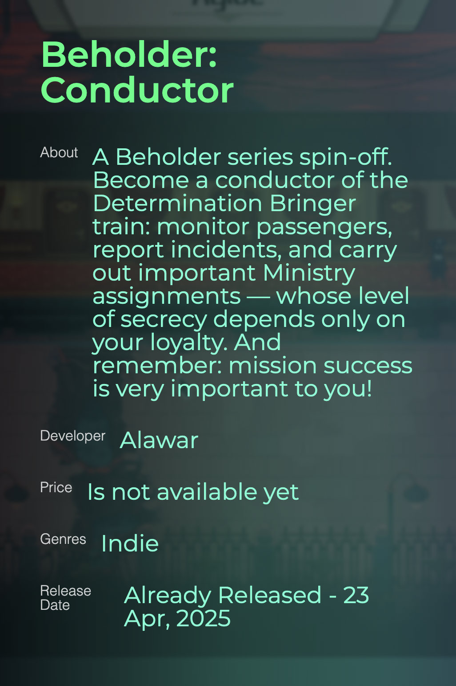

    Genres wordt geloopt binnen de api array van de soorten genres gekoppeld aan die game. Ze bewegen speels heen en terug en wisselen elkaar visueel af met een ViewTransition die het er smooth uit laat zien.

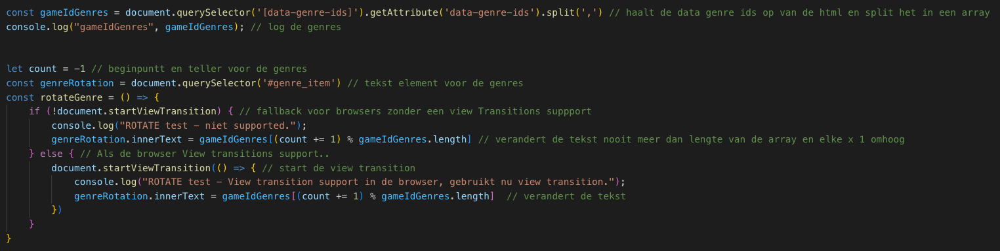

    En ik heb er dus in css een leuke beweging bij gemaakt zodat ze elkaar mooi afwisselen
    
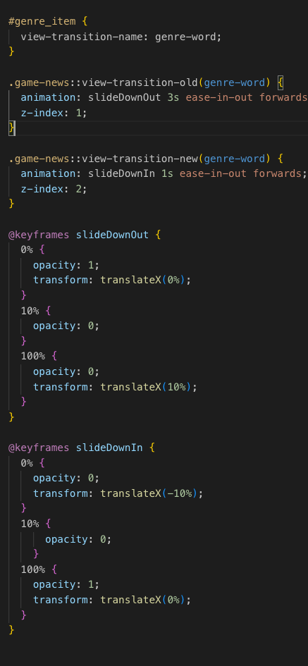

    Ik heb ook goed zitten strugglen met het feit dat ik data uit de api in een array naar mijn frontend wil brengen. En toen kwam declan met de uitleg dat als je een data attribute gebruikt je hem gewoon kan pakken met de querySelector dus dat heb ik gebruikt. Werkt top, wist wel van het bestaan van data- attribute af maaar niet dat het op deze manier ingezet kan worden.

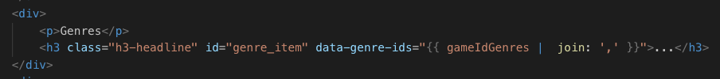

Al met al echt een tof project. Heb ontzettend veel geleerd, eigenlijk was alles nieuwe voor me omtrent de JS en API en alles. Echt blij met het restultaat en ik vind het ontzettend gaaf dat je nu een dynamische website hebt met data van een grote bekende speler (Steam). Thanks Cyd En Declan voor de hulp/het aanleren!

# API @cmda-minor-web 2024 - 2025
Het web is een geweldige plek en de beschikbare technologieën ervan zijn vandaag de dag krachtiger dan ooit tevoren.
De kracht van het web ligt in het feit dat het een platform is dat voor iedereen beschikbaar is en dat het gebaseerd is
op open standaarden. De technologieën worden ontworpen en gespecificeerd op basis van consensus en zijn niet in handen
van één enkele entiteit.

Desondanks zijn er veel mensen en bedrijven die vinden dat het internet niet voldoet aan hun behoeften. Dit blijkt uit
de pogingen van grote techbedrijven om hun eigen afgesloten ecosystemen te creëren. Ze streven hiermee naar controle over
zowel de gebruikerservaring als de gegenereerde data.

**In dit vier weken durende vak zullen we de kracht van het web ervaren en kijken hoe we (mobiele) web apps kunnen maken die
net zo aantrekkelijk zijn als native mobiele apps. We beginnen met het maken van een server-side gerenderde applicatie
waarbij we geleidelijk de gebruikerservaring verbeteren met relevante beschikbare web API's.**

[TLDR; hoe zet ik mijn project op?](#Inrichten-ontwikkelomgeving)

## Doelen

Na deze cursus zul je:

- In staat zijn om een server-side gerenderde applicatie te maken.
- In staat zijn om een enerverende gebruikerservaring te creëren.
- Een breder begrip hebben van het web en zijn mogelijkheden.

## Opdracht

In dit vak zullen we een van de meest voorkomende app-concepten van vandaag
gebruiken en ontdekken dat we deze kunnen maken met moderne webtechnologie
met als doel om een rijke gebruikerservaring creëeren.

Randvoorwaarden:

- Minimaal een overzichts- en detailpagina
- Gebouwd in TinyHTTP + Liquid
- Minimaal een content API
- Minimaal twee Web API's

Voorbeelden:

- Maak je eigen streamingplatform (Netflix/Spotify).
- Maak je eigen doom-scroll-app (Instagram/TikTok).
- Maak je eigen chatapplicatie (WhatsApp/Signal).
- Een andere app die je zelf leuk vindt...

Voorbeeld content API's die je kan gebruiken:

- [MovieDB API](https://developer.themoviedb.org/reference/intro/getting-started)
- [Rijksmuseum API](https://data.rijksmuseum.nl/object-metadata/api/)
- [Spotify API](https://developer.spotify.com/documentation/web-api)
- ...

Voorbeelden van Web API's die je kan gebruiken:

- [Page Transition API voor animaties tusse npagina's](https://developer.mozilla.org/en-US/docs/Web/API/Page_Transitions_API)
- [Web Animations API voor complexe animaties](https://developer.mozilla.org/en-US/docs/Web/API/Web_Animations_API)
- [Service Worker API voor installable web apps](https://developer.mozilla.org/en-US/docs/Web/API/Service_Worker_API)
- [Web Push API voor push notifications](https://developer.mozilla.org/en-US/docs/Web/API/Push_API)
- [Server sent events voor realtime functionaliteit](https://developer.mozilla.org/en-US/docs/Web/API/Server-sent_events)
- [Geolocation API](https://developer.mozilla.org/en-US/docs/Web/API/Geolocation_API)
- [Web Speech API](https://developer.mozilla.org/en-US/docs/Web/API/Web_Speech_API)
- [Web Share API voor sharen van content binnen de context van de gebruiker](https://developer.mozilla.org/en-US/docs/Web/API/Navigator/share)
- ...

De lijst is eindeloos, laat je vooral inspireren op de overzichtspagina van [MDN](https://developer.mozilla.org/en-US/docs/Web/API).

## Beoordeling
De beoordelingscriteria zijn te vinden op [DLO](https://dlo.mijnhva.nl/d2l/le/content/609470/Home)

## Planning

| Planning                   | Maandag               | Dinsdag            | Vrijdag                                     |
|----------------------------|-----------------------|--------------------|---------------------------------------------|
| Week 1 - Kickoff & concept | Introductie ne uitleg | Workshops          | Feedback gesprekken                         |
| Week 2 - The baseline      | College + workshops   | Workshops          | Feedback gesprekken                         |
| Week 3 - Enhance           | College + workshops   | Workshops          | Feedback gesprekken(*DONDERDAG*)            |
| Week 4 - Enhance & wrap up | Tweede paasdag        | Individuele vragen | Beoordelingsgesprekken(*DONDERDAG/VRIJDAG*) |

## Bronnen

- [Nodejs.org](https://nodejs.org/en/), voor de installatie van NodeJS op jouw systeem, kies voor NodeJS 22.13.1 Long Term Support. Dit is de meest stabiele versie van NodeJS, welke ondersteund wordt met goede documentatie.
- [VSCode How To Open Terminal](https://www.youtube.com/watch?v=OmQhOnBzg_k), om iemand de terminal te zien openen en gebruiken op Youtube.
- [Introduction to NodeJS](https://nodejs.dev/en/learn/), voor een in depth introductie met de NodeJS ontwikkelomgeving. Let op: dit is best een technisch verhaal. De eerste zes pagina’s zijn interessant.
- Om serverside te kunnen renderen maken we gebruik van [TinyHttp](https://github.com/tinyhttp).
- Voor templating maken we gebruik van [LiquidJS](https://liquidjs.com/).
- [Liquid Filters](https://liquidjs.com/filters/overview.html)
- Voor build tooling(CSS en JS) maken we gebruik [Vite](https://vitejs.dev/).
- [Using the Fetch API @ MDN](https://developer.mozilla.org/en-US/docs/Web/API/Fetch_API/Using_Fetch)
- [JSON.parse() @ MDN](https://developer.mozilla.org/en-US/docs/Web/JavaScript/Reference/Global_Objects/JSON/parse)
- [Partial commits in GitHub Desktop](https://github.blog/news-insights/product-news/partial-commits-in-github-for-windows/)
- [Committing and reviewing changes to your project in GitHub Desktop](https://docs.github.com/en/desktop/making-changes-in-a-branch/committing-and-reviewing-changes-to-your-project-in-github-desktop)

## Inrichten ontwikkelomgeving

1. Navigeer naar [nodejs.org](https://nodejs.org/en/) en installeer de NodeJS ontwikkelomgeving. Kies voor _NodeJS 22.13.1 with long-term support_, download de benodigde bestanden en doorloop het installatieproces.

2. Fork daarna [deze repository](https://github.com/cmda-minor-web/API-2425) en *clone* deze op jouw computer.

3. Open deze repository in je code editor.

4. Open de _Terminal_ in Visual Studio Code door de toetscombinatie `` ^` `` (control + `) te gebruiken. Er opent een terminalscherm in de hoofdmap van jouw project.

5. Voer in de terminal het commando `npm install` uit, door het in te typen en op enter te drukken. Je gebruikt _NPM_, de _NodeJS Package Manager_ om alle _afhankelijkheden_ voor dit project te installeren. NPM is een veelgebruikte package manager in frontend land. Voor dit project gebruiken we _TinyHTTP_ (om een _server_ te maken) en _Liquid_ (om HTML te _renderen_).
- (Optioneel) Na de installatie is de map `node_modules` aangemaakt, en gevuld met allerlei _packages_. Scroll eens door deze map heen; vele honderden *open source* ontwikkelaars hebben de packages die je ziet gebouwd en die mag je gratis gebruiken. Ontwikkelen in NodeJS is *standing on the shoulders of giants*.

### Project starten en stoppen
Start het voorbeeldproject op door in de terminal het commando `npm run dev` uit te voeren. Als het goed is, komt een melding te staan over het opstarten van de server: `Server available on http://localhost:3000` — Open deze URL in je browser. Let op: Vite draait op een andere poort dan TinyHTTP, dus je moet de poort van TinyHTTP gebruiken: http://localhost:3000

Als het werkt, zet je je server weer uit door in de terminal de toetscombinatie `^c` (control + c) in te voeren. Deze toetsencombinatie wordt in de terminal gebruikt om de huidige taak te stoppen en *controle* (vandaar de c) terug te krijgen van het programma.

- Optioneel: Volg het [NodeJS ‘Hello World’ voorbeeld](https://medium.com/@mohammedijas/hello-world-in-node-js-b333275ddc89)
- Optioneel, iets technischer: Lees de eerste vijf delen van [Introduction to Node](https://nodejs.dev/en/learn/) als je een meer in-depth introductie wilt met de NodeJS ontwikkelomgeving.

